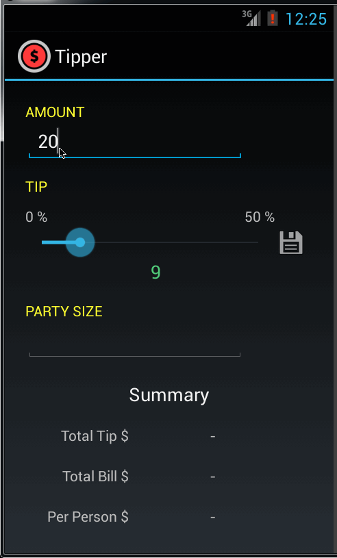

Tip Calculator
=============

This is an android application to calculate and display the Tip amount and per-person dollar amount for the specified parameters.

Time Spent: 10 hours spent in total

Completed User Stories:

* [x] Required: User is displayed the tip of specified percentage for specified entered amount
* [x] Required: User enters the total amount of the transaction
* [x] Required: User can select between tip amounts (i.e 10%, 15%, 20%)
* [x] Required: Upon selecting tip amount, formatted tip value is displayed
* [x] Optional: User changes the total amount and updated tip is reflected automatically
* [x] Optional: User can select custom tip percentage if desired
* [x] Optional: User can select how many ways to split the tip
* [x] Optional: User can edit preset tip percentages and have them persist across launches
* [x] Optional: Experiment with trying input widgets to replace the buttons and/or textviews
* [x] Optional: Improve the user interface and experience by using images and/or colors

Notes:

Spent some time making the UI look prettier by using widgets like SeekBar along with using a different in built Theme. Also created a couple of Color resources and used the same. Created an icon using iconmastr and used it as the application icon.

Walkthrough of all user stories:

